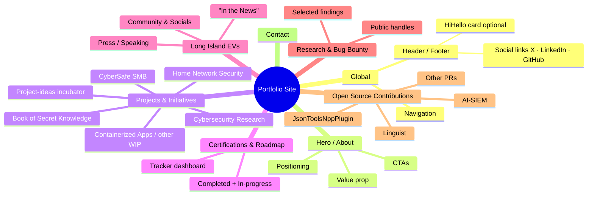

# Portfolio Content Outline

> Living document for jacob-kraniak.github.io  
> Last updated: 2026-07-25  
> Status: Rough brainstorm → structured outline  
> Branch: `docs/content-outline`

This file is **internal documentation only**. It is not rendered on the live site. Use it as a single source of truth while gathering and refining content.

---

## Site Map (Mindmap)

---

## 1. Global Elements

- **Header / Footer**
  - Social links: X (`@JacobSk92`), LinkedIn, GitHub
  - Optional: HiHello digital business card (easy contact exchange)
- **Navigation**: Home · Projects · Certifications · Long Island EVs · Contact

## 2. Hero / About

- Short professional positioning (Security Systems Engineer + cybersecurity practitioner + community builder)
- One-sentence value proposition
- Primary CTAs: Resume · Contact · View Projects
- Inspirational Quotes. My favorite quotes from tech leaders, authors, film/tv that align with my core principles and values.

## 3. Projects & Initiatives

| Project | Source / Repo | Status | Notes |
|---------|---------------|--------|-------|
| Home Network Security | `home-network-security` | Active | Diagrams, inventories, Wazuh, Proxmox, containerization |
| CyberSafe SMB | `cybersafe_smb` + cybersafehome.org | Live service | Affordable SMB audits + local pro-bono work |
| Cybersecurity Research | `cybersecurity-research` | Active | Responsible disclosure / write-ups focus |
| Project Ideas incubator | `Project-ideas` | Ongoing | Meta — shows systematic ideation process |
| Book of Secret Knowledge | Contribution / heavy use of trimstray repo | Idea | Frame as ongoing knowledge curation |
| Containerized Apps | (to be linked) | Idea | |
| Other WIP | From Project-ideas + private notes | Idea | **NDA check required** for any employer-related items |

## 4. Certifications & Learning Roadmap

- Source of truth: `cybersecurity-certification-tracker`
- Display as a clean dashboard / progress timeline (not a plain list)
- Show both completed certifications and the current roadmap

## 5. Long Island EVs (dedicated section or sub-page)

- Mission & community impact
- Social presence (X, Instagram, YouTube, Linktree)
- Press / speaking appearances (“In the News”)
  - Farmingdale State College EV Symposium speaker
  - Newsday mentions, Drive Electric Long Island volunteer work, etc.
- Link out to the separate LongIslandEVs presence

## 6. Research & Bug Bounty

- Public handles: Bugcrowd, Intigriti, etc. (confirm public profiles)
- High-level stats or selected public findings only (no sensitive details)

## 7. Open Source Contributions

- Notable public contributions / merged PRs
  - AI-SIEM
  - Linguist
  - JsonToolsNppPlugin
  - Others as they appear
- GitHub profile highlights

## 8. Contact

- Preferred contact methods
- HiHello card (if integrated)
- Social links repeated for convenience

---

## Maintenance Notes

- This file is **internal documentation only** — it must never be rendered on the live site.
- Update the Status column and the mindmap as content is written or priorities change.
- Always respect NDAs for any employer-related work.
- Prefer linking to public repos rather than duplicating large amounts of content.
- When a section is ready for the live site, move the polished copy into the appropriate Gatsby page/component and leave a note here.

---

*Next actions:*  
1. Fill in actual copy for the highest-priority sections.  
2. Decide which projects become full case studies vs. simple cards.  
3. Decide on HiHello integration approach.  
4. Confirm public bug-bounty handles.
